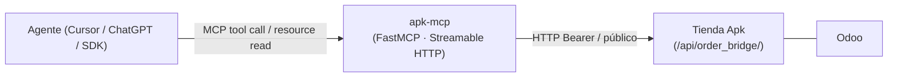
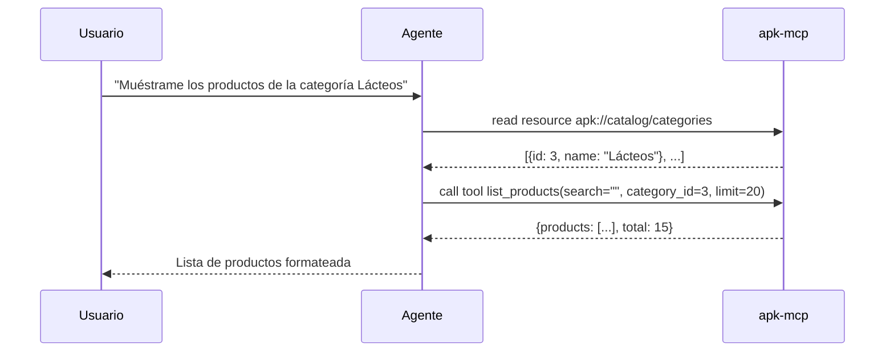
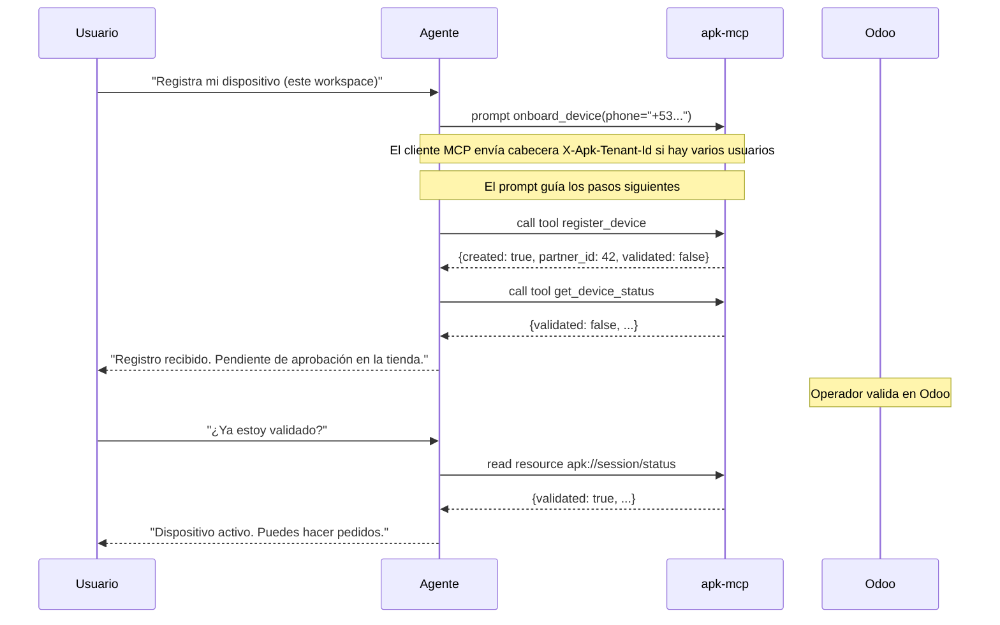
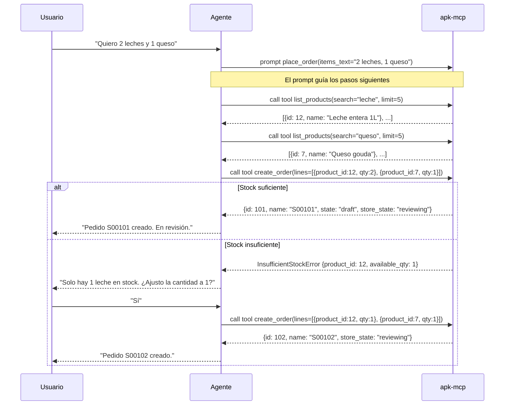

# Flujo de uso de apk-mcp dentro de un agente

Este documento explica, paso a paso y con ejemplos concretos, cómo un agente (Cursor, ChatGPT, SDK propio, etc.) interactúa con este servidor MCP. Está orientado a programadores que integran o extienden la capa de agente sobre Tienda Apk, no a usuarios finales.

Para la estructura interna del servidor ver [arquitectura.md](arquitectura.md). Para la tabla completa de tools, resources y prompts disponibles ver el [README](../README.md).

---

## 1. Qué papel cumple este MCP

**apk-mcp** es un servidor MCP que actúa de puente entre el agente y la API REST `order_bridge` de Tienda Apk (Odoo). El agente nunca habla directamente con la API Odoo: llama a tools del MCP, lee resources del MCP, y opcionalmente activa prompts del MCP.



---

## 2. Cómo se conecta el agente

El servidor usa **Streamable HTTP** (FastMCP 3.x). La URL del endpoint es:

```
https://<tu-host>/mcp          # producción / staging
http://localhost:8000/mcp      # desarrollo local
```

La ruta y el puerto se controlan con `MCP_PATH` y `MCP_PORT` en `.env` (ver README). No hay WebSocket ni stdio: el agente abre sesiones HTTP al endpoint anterior.

### Registro en el host del agente

**Cursor** — añade en tu `mcp.json` o en la configuración MCP del workspace:

```json
{
  "mcpServers": {
    "apk-mcp": {
      "url": "https://<tu-host>/mcp",
      "transport": "streamable-http"
    }
  }
}
```

**ChatGPT / OpenAI Agents SDK** — añade el servidor como herramienta MCP remota con la misma URL.

**SDK propio** — usa cualquier cliente MCP compatible con Streamable HTTP y apunta a esa URL.

Una vez conectado, el host negocia capacidades con el servidor y el agente puede listar e invocar tools, leer resources y obtener plantillas de prompts.

**Multi-tenant (Streamable HTTP):** cada petición HTTP al endpoint MCP puede llevar la cabecera **`X-Apk-Tenant-Id`** (nombre configurable con `APK_MCP_TENANT_HEADER`) para aislar dispositivos y pedidos por cliente. Si no la envías y `APK_MCP_REQUIRE_TENANT_HEADER` es `false`, el servidor usa el tenant de respaldo `APK_MCP_FALLBACK_TENANT_ID` (por defecto `default`), adecuado para desarrollo local.

---

## 3. Las tres primitivas MCP y cómo usarlas

### Tools — para actuar

Los tools ejecutan una acción o consulta contra la API. El agente los invoca pasando parámetros tipados y recibe una respuesta JSON.

| Grupo | Tools | Requiere Bearer |
|-------|-------|-----------------|
| Catálogo | `list_products`, `get_product` | No |
| Dispositivo | `register_device`, `get_device_status` | No / Sí |
| Pedidos | `list_orders`, `get_order`, `create_order`, `cancel_order` | Sí |
| Perfil | `get_profile`, `update_profile`, `replace_profile` | Sí |
| Push | `register_push_token`, `update_push_topics` | Sí |

Ejemplo de llamada desde el agente (pseudocódigo):

```python
result = await mcp.call_tool("list_products", {"search": "arroz", "limit": 10})
# result → {"products": [...], "total": 42}
```

Los tools públicos funcionan sin ningún setup previo. Los tools Bearer requieren que el dispositivo esté registrado y validado en Odoo (ver sección 5).

### Resources — para leer contexto

Los resources exponen datos de solo lectura bajo el esquema de URI `apk://`. El agente los adjunta como contexto antes de decidir qué acción tomar, o los lee para resolver IDs antes de llamar un tool.

| URI | Datos |
|-----|-------|
| `apk://catalog/categories` | Lista completa de categorías |
| `apk://catalog/banners` | Banners publicitarios activos |
| `apk://catalog/products/{product_id}` | Detalle de un producto |
| `apk://store/settings` | Teléfono y config general de la tienda |
| `apk://locations/municipalities` | Municipios y barrios (para resolver IDs de dirección) |
| `apk://session/status` | Estado de validación del dispositivo (Bearer) |
| `apk://session/profile` | Perfil del contacto (Bearer) |
| `apk://orders/{order_id}` | Detalle de un pedido con líneas (Bearer) |

Ejemplo: antes de actualizar una dirección, el agente lee `apk://locations/municipalities` para resolver el nombre del municipio a un ID numérico, y solo entonces llama al tool `update_profile`.

### Prompts — para orquestar flujos multi-paso

Los prompts son plantillas de instrucción que el servidor devuelve como `list[Message]`. El host los inyecta en el contexto del agente para guiarlo a través de una secuencia de llamadas, sin que el integrador tenga que describir ese flujo a mano en su system prompt.

| Prompt | Propósito |
|--------|-----------|
| `find_products(query, category?, limit?)` | Búsqueda con resolución automática de categoría |
| `place_order(items_text)` | Carrito en lenguaje natural → `create_order` con manejo de stock |
| `track_order(order_id)` | Estado y líneas formateadas de un pedido |
| `reorder_last()` | Repetir el último pedido con confirmación |
| `update_my_address(street, state, municipality_name, neighborhood_name)` | Actualizar dirección resolviendo IDs |
| `onboard_device(phone?)` | Registrar dispositivo y reportar estado de validación |

Cuándo usarlos: activa un prompt cuando la intención del usuario requiere **varias llamadas coordinadas**. Para una consulta simple (`"¿qué productos hay?"`) basta con invocar el tool directamente.

---

## 4. Flujos típicos de extremo a extremo

### 4.1 Solo catálogo (sin autenticación)

El flujo más simple: no requiere token Bearer ni registro de dispositivo.



El agente puede simplificar este flujo usando el prompt `find_products("", category="Lácteos")`, que incluye la misma lógica de resolución de categoría como instrucción guiada.

### 4.2 Onboarding de dispositivo

Antes de acceder a cualquier ruta Bearer es necesario registrar el dispositivo y esperar validación en Odoo.



**Nota sobre credenciales:** el servidor MCP genera **por tenant** un token opaco en memoria y lo usa como `device_key` en `POST /register` y como Bearer en Tienda Apk. Distintos valores de `X-Apk-Tenant-Id` obtienen distintos dispositivos. Si reinicias el proceso MCP, las claves en memoria se pierden y puede hacer falta volver a registrar en Odoo. Ver sección 5.

### 4.3 Realizar un pedido

Este flujo demuestra el uso combinado de tools públicos, tools Bearer y manejo de errores de stock.



### 4.3.1 Carrito del servidor (`add_to_cart` / `checkout_cart`)

El carrito se identifica con el **dominio** del backend Odoo (sin `https://`) y el **user_token** del `shop-key`, no con la cabecera completa.

| Entorno | Almacenamiento | Variable |
|---------|----------------|----------|
| Desarrollo local | Memoria del proceso | `CART_STORE_BACKEND=memory` (por defecto) |
| Lambda / producción | DynamoDB (`backend` + `token`) | `CART_STORE_BACKEND=dynamodb` |

Flujo típico: `add_to_cart` → `get_cart` → `checkout_cart` (crea pedido en Odoo y vacía el carrito si tiene éxito).

### 4.4 Actualizar dirección

Muestra el patrón típico de leer un resource para resolver IDs antes de mutar con un tool.

```
Usuario: "Cambia mi dirección a Calle 5, municipio Holguín, reparto Peralta"

1. Agente activa prompt update_my_address(street="Calle 5", state="Holguín", ...)
2. Lee apk://locations/municipalities → {id: 8, name: "Holguín", neighborhoods: [{id: 42, name: "Peralta"}, ...]}
3. Llama update_profile(street="Calle 5", state="Holguín", municipality_id=8, neighborhood_id=42)
4. Llama get_profile → confirma el cambio al usuario
```

---

## 5. Autenticación y límites operativos

### Credenciales por tenant en memoria

El servidor mantiene un mapa **tenant_id → token** (`InMemoryTenantCredentialStore`) generado con `secrets.token_urlsafe`. Ese mismo valor se envía como **`device_key`** al registrar y como **Bearer** en rutas autenticadas hacia Tienda Apk.

Consecuencias para el integrador:

- **No hay persistencia en disco.** Si reinicias el proceso MCP, los tokens por tenant se regeneran; en Odoo puede ser necesario repetir registro/aprobación según tu política.
- **Varios usuarios en paralelo:** configura cabeceras distintas por cliente (`X-Apk-Tenant-Id` u otra vía `APK_MCP_TENANT_HEADER`) para que no compartan pedidos ni perfil.
- **Un 401 remoto no siempre indica problema local.** Puede ser dispositivo no aprobado en Odoo, no solo un fallo de token.

### Rutas públicas vs Bearer

Las rutas de catálogo, banners, configuración de tienda, municipios y registro de dispositivo son **públicas** y funcionan sin Bearer. El resto (pedidos, perfil, push, estado de sesión) requieren que el dispositivo esté registrado y validado.

---

## 6. Checklist para el integrador

Antes de conectar un agente a este MCP, verifica lo siguiente:

1. El servidor MCP está desplegado y accesible (HTTPS si el cliente es remoto).
2. La cabecera `shop-key` incluye la URL del backend Odoo (`Bearer` + base64 `URL|user_token`) con el módulo `order_bridge` activo.
3. La URL del endpoint MCP (`/mcp`) está configurada en el host del agente.
4. Si el agente necesita rutas Bearer: el dispositivo del **tenant actual** (cabecera MCP) está registrado y validado en Odoo.
5. El system prompt del agente menciona que debe usar los **prompts MCP** para flujos multi-paso (`place_order`, `find_products`, etc.) en lugar de reinventar la orquestación.
6. Se contempla el ciclo de vida del token en memoria: un reinicio del servidor MCP regenera credenciales; en despliegues multi-usuario envía siempre la cabecera de tenant acordada.
